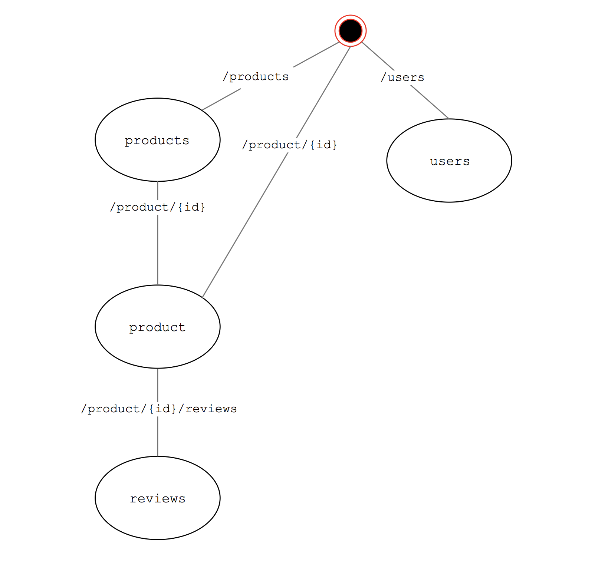

# API Design Workshop

## Requirements

- Read [Adidas API Guidelines](https://adidas-group.gitbooks.io/api-guidelines/content/)
- [Draw.io](https://www.draw.io/)
- Git
- Code editor

## Design challenge

As a new assignement you are asked to add a wishlist feature to our adidas ecom (website, native apps). 

You've decided wisly to think [API First](https://adidas-group.gitbooks.io/api-guidelines/content/core-principles/api-first.html) and [API Design First](https://adidas-group.gitbooks.io/api-guidelines/content/core-principles/design-maturity.html).

You've assigned 4 user stories:

- As a user, I want to add a product in my wishlist
- As a user, I want to retrieve my wishlist
- As a user, I want to delete a specific product from mt wishlist
- As a user, I want to clear my wishlist

## Existing affordances (actions)

The existing core Product API privides this affordances:  

- Retrieve the list of products
- Retrieve a single product
- Create a product
- Update an existing product (status...)
- Retrieve reviews about a product
- Add a product review
- Create a user
- Retrieve user profile

## Step1. Let's draw!

Task: In this step we extend an existing state diagrams for the proposed API. Each box in the diagram represents a possible representation. You can use arrows to indicate transitions from one box to the next.

You can use [draw.io](draw.io) to extend 
You can extend the existing diagram below, hosted [here](./product_draw.xml): 

This state machine diagram will help you to identify the main ressources and their relations.

## Step2. Let's describe what actions our API affords

List the new API affodrances

## Step3. Formalize the design in the [Open API Specification](http://swagger.io/specification/)

Task: Extend the existing swagger.yaml

> The OAS file can be edited in whatever tool you like *BUT NOT GENERATED FROM YOUR CODE*, the most important thing is that the aprouved one (the contract) *MUST* be in Apiary.

## Step4. Verify the design using Apiary Documentation and Apiary Mock Service

Task: Try the Apiary mock service

## Step5. Review the API Design

At this stage you:

- Ask feedback from your API users by sending to them the documentation link.
- Ask feedback from your product owner

If your API looks like this remote control then your design is affordant!

## Step6. Sync your API contract

> Every API description MUST be published in adidas API design platform (apiary.io) and SHOULD be stored in version control system (Bitbucket, GitHub) in the same repository as the
 API implementation.

- Host your API in github
- Setup up Github/apiary Sync

//Show it

## Step7. Setup API contract testing

Descibe steps:
- Git merge with implem branch...simple app with only the root endpoint.
- 

- Try dredd docker image.

//Show it

## Some example of good designed APIs

Sample APIs following the guidelines are available at [adidas-group GitHub](https://github.com/adidas-group). The samples include the following:

### [Simple API](https://github.com/adidas-group/demo-simple-api)
Very simple API including implementation, testing, and full CI/CD lifecycle.

### [Approval API](https://github.com/adidas-group/demo-approval-api)
Real-world API with state transition, API key client app authentication, exposed via API management.

### [Orders API](https://github.com/adidas-group/demo-orders-api)
Sample API used as the template for newly created projects at Apiary.

### [Inventory API](https://eainventoryapi.docs.apiary.io/)
Real-world Adidas Inventory API (WIP)

### [Appointment Service](https://github.com/adidas-group/demo-appointment-service)
Demo API, including implementation and testing used during training.

### [Complex Search Parameters](https://github.com/adidas-group/demo-complex-search)
Sample API showcasing description of complex query parameter rules.

### [CPM] Asset Trafficker https://assetmanager4.docs.apiary.io/

## Some example of bad designed APIs

### [[Sales and Distribution] Returns Confirmation API](https://returnsconfirmation.docs.apiary.io/)
Missing description
Missing examples
Missing HAL
Exposing internal model
Missing support contact

### [ATP Notification Service](https://atpnotificationservice.docs.apiary.io/)
Usage of acronyms, what's ATP stands for ?
Missing description / context
Missing HAL
Missing support contact

